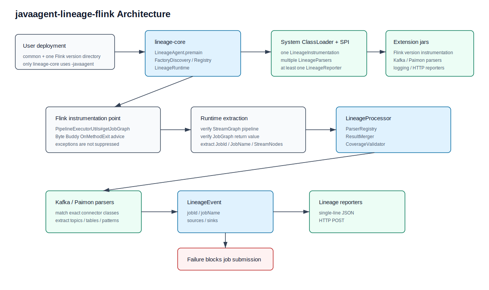

# javaagent-lineage-flink

`javaagent-lineage-flink` is a Java Agent based lineage collector for Apache Flink.

It intercepts Flink job graph generation, extracts job-level source and sink datasets, and reports a compact `LineageEvent`. The project is designed for production Flink clusters where lineage must be resolved before a job is submitted.

Currently supported:

| Flink version | Connector / parser | Supported lineage |
| --- | --- | --- |
| `1.19.3` | Kafka connector `3.3.0-1.19` | Kafka source and sink for DataStream and Flink SQL |
| `1.20.0` | Kafka connector `3.4.0-1.20` | Kafka source and sink for DataStream and Flink SQL |
| `1.20.0` | Paimon `1.4` | Paimon source, exact-table sink, and CDC combined dynamic sink metadata |

Supported reporters:

| Reporter | Output |
| --- | --- |
| Logging reporter | Single-line JSON lineage event |
| HTTP reporter | Synchronous HTTP POST lineage event |

## Why this project

Flink jobs can be created through different APIs, including DataStream and Flink SQL. Instead of integrating with every API entry point, this agent hooks into the common JobGraph generation path:

```text
PipelineExecutorUtils#getJobGraph(...)
```

When the input pipeline is a `StreamGraph`, the agent reads the generated `JobGraph` for `JobID`, reads the `StreamGraph` for stream nodes, parses external endpoints from those nodes, and reports:

- job id
- job name
- source datasets
- sink datasets

The project intentionally focuses on actual external read/write datasets. A lineage source or sink is not required to be a Flink API `Source` or `Sink` operator. For example, a connector-specific writer operator can still be parsed as a lineage sink.

## Design principles

- No runtime Flink or connector version detection.
- Users install the jars matching their Flink and connector versions.
- Incompatible versions fail normally and fail fast.
- Core, Flink instrumentation, connector lineage parsers, and reporters are packaged separately.
- Phase 1 uses the system classloader and `ServiceLoader`; no custom classloader is introduced.
- No external config file is required in phase 1.
- Lineage parsing and reporting errors are propagated to block job submission.
- `lineage-core` is the only jar passed to `-javaagent`.
- Other lineage jars are placed on the Flink runtime classpath, usually `$FLINK_HOME/lib`.

## Module layout

```text
javaagent-lineage-flink/
├── lineage-core/
├── lineage-flink/
│   ├── lineage-flink-1.19/
│       ├── lineage-flink-instrumentation/
│       └── lineage-flink-parser-kafka-3.3.0/
│   └── lineage-flink-1.20/
│       ├── lineage-flink-instrumentation/
│       ├── lineage-flink-parser-kafka-3.4.0/
│       └── lineage-flink-parser-paimon-1.4/
├── lineage-reporter/
│   ├── lineage-reporter-logging/
│   └── lineage-reporter-http/
└── lineage-dist/
```

Runtime artifacts in the current distribution:

```text
lineage-core
lineage-flink-1.19-instrumentation
lineage-flink-parser-kafka-3.3.0-1.19
lineage-flink-1.20-instrumentation
lineage-flink-parser-kafka-3.4.0-1.20
lineage-flink-parser-paimon-1.4-1.20
lineage-reporter-logging
lineage-reporter-http
```

Version ownership:

- `lineage-flink/lineage-flink-1.19` owns `flink.version=1.19.3`.
- `lineage-flink-parser-kafka-3.3.0` owns `kafka.connector.version=3.3.0-1.19`.
- `lineage-flink/lineage-flink-1.20` owns `flink.version=1.20.0`.
- `lineage-flink-parser-kafka-3.4.0` owns `kafka.connector.version=3.4.0-1.20`.
- `lineage-flink-parser-paimon-1.4` owns `paimon.version=1.4.1` and depends on `paimon-flink-1.20` with `provided` scope.
- The root project does not define Flink or connector versions.

## Architecture



```text
Flink JVM
  ├─ -javaagent: lineage-core
  │    ├─ discovers factories by ServiceLoader
  │    ├─ initializes runtime
  │    └─ installs instrumentation
  │
  ├─ lineage-flink-{flink.version}-instrumentation
  │    └─ intercepts PipelineExecutorUtils#getJobGraph for the selected Flink version
  │
  ├─ lineage-flink-parser-kafka-{connector.version}
  │    └─ parses Kafka source/sink endpoints from StreamNode
  ├─ lineage-flink-parser-paimon-1.4
  │    └─ parses Paimon source/sink endpoints from StreamNode
  │
  └─ lineage-reporter-*
       └─ reports LineageEvent
```

Processing flow:

```text
LineageAgent.premain()
  -> discover LineageFactory implementations
  -> install Flink instrumentation

PipelineExecutorUtils#getJobGraph(...) returns
  -> verify Pipeline is StreamGraph
  -> read JobID from JobGraph
  -> read job name and StreamNodes from StreamGraph
  -> convert StreamNodes to LineageNode
  -> LineageRuntime.processLineage(...)
  -> parser registry parses source/sink datasets
  -> coverage validator verifies both source and sink exist
  -> reporter registry emits LineageEvent
```

## Build

Requirements:

- JDK 8+
- Maven 3.6+

Build all modules:

```bash
mvn test package
```

Build the distribution package:

```bash
mvn -pl lineage-dist -am package
```

Generated distribution files:

```text
lineage-dist/target/lineage-dist-1.0.0-SNAPSHOT.tar.gz
lineage-dist/target/lineage-dist-1.0.0-SNAPSHOT.zip
```

The distribution contains:

```text
javaagent-lineage-flink-1.0.0-SNAPSHOT/
└── lib/
    ├── common/
    │   └── lineage-core-1.0.0-SNAPSHOT.jar
    ├── flink-1.19/
    │   ├── lineage-flink-1.19-instrumentation-1.0.0-SNAPSHOT.jar
    │   └── lineage-flink-parser-kafka-3.3.0-1.19-1.0.0-SNAPSHOT.jar
    ├── flink-1.20/
    │   ├── lineage-flink-1.20-instrumentation-1.0.0-SNAPSHOT.jar
    │   ├── lineage-flink-parser-kafka-3.4.0-1.20-1.0.0-SNAPSHOT.jar
    │   └── lineage-flink-parser-paimon-1.4-1.20-1.0.0-SNAPSHOT.jar
    └── reporter/
        ├── lineage-reporter-logging-1.0.0-SNAPSHOT.jar
        └── lineage-reporter-http-1.0.0-SNAPSHOT.jar
```

## Quickstart

See [docs/quickstart.md](docs/quickstart.md) for practical deployment examples, including local `flink run`, Web UI submission, YARN application mode, HTTP reporter configuration, and local debugging.

## Example output

The logging reporter emits a single-line event similar to:

```json
{"engineType":"flink","jobId":"...","jobName":"lineage-agent-kafka-debug","timestamp":1784357204468,"sources":[{"connector":"kafka","namespace":"broker-a:9092,broker-b:9092","name":"orders-input","properties":{"topic":"orders-input","bootstrap.servers":"broker-a:9092,broker-b:9092"}}],"sinks":[{"connector":"kafka","namespace":"broker-a:9092,broker-b:9092","name":"orders-output","properties":{"topic":"orders-output","bootstrap.servers":"broker-a:9092,broker-b:9092"}}]}
```

For Kafka datasets:

- `connector`: `kafka`
- `namespace`: Kafka `bootstrap.servers`
- `name`: topic
- `direction`: represented by placement in `sources` or `sinks`

For Paimon datasets:

- `connector`: `paimon`
- `namespace`: catalog-level warehouse when available
- `name`: `database.table` for exact-table source/sink; `target_database.*` for CDC combined dynamic sink when target database is available, otherwise `*`
- `direction`: represented by placement in `sources` or `sinks`
- `properties.sourceMode` / `properties.sinkMode`: `EXACT_TABLE` or `CDC_COMBINED`
- `properties.fullName`: `database.table` for exact-table datasets
- `properties.tablePath`: optional physical table path metadata; it is not used as warehouse
- `properties.targetDatabase`, `targetTable`: CDC combined target range; `targetTable` is `*`
- `properties.sourceDatabaseIncludePattern`, `sourceDatabaseExcludePattern`, `sourceTableIncludePattern`, `sourceTableExcludePattern`: CDC source-side matching rules used by combined routing
- `properties.tableNameCaseSensitive`, `tableNameMergeShards`, `tableNamePrefix`, `tableNameSuffix`, `databasePrefixMapping`, `databaseSuffixMapping`, `tableNameMapping`: stable target table naming rules for inferring which dynamic target tables a combined job may write

## Extension points

The core discovers components through:

```text
META-INF/services/io.github.tkilome.flink.lineage.api.factory.LineageFactory
```

Supported factory types:

- `LineageInstrumentationFactory`
- `LineageParserFactory`
- `LineageReporterFactory`

To add a new connector parser:

1. Create a parser module under the matching Flink version module.
2. Depend on the exact connector version with `provided` scope.
3. Implement `LineageParserFactory`.
4. Return `LineageParseResult.notMatched()` if the node is unrelated.
5. Return `LineageParseResult.matched(...)` if the node contains a relevant endpoint.
6. Register the factory in `META-INF/services/io.github.tkilome.flink.lineage.api.factory.LineageFactory`.
7. Put the parser jar into `$FLINK_HOME/lib`.

To add a reporter:

1. Create a module under `lineage-reporter`.
2. Implement `LineageReporterFactory`.
3. Implement `LineageReporter`.
4. Register the factory through the same `LineageFactory` service file.
5. Put the reporter jar into `$FLINK_HOME/lib`.

## Fail-fast behavior

The agent is intentionally strict:

- If initialization fails, job submission fails.
- If instrumentation fails, job submission fails.
- If parser code is incompatible with the runtime Flink or connector version, job submission fails.
- If no source or no sink is parsed from the job, job submission fails.
- If reporting fails, job submission fails.

This behavior is deliberate. A user enabling this agent expects lineage to be available before the job starts.

## Current limitations

- Implemented Flink versions: `1.19.3`, `1.20.0`.
- Implemented Kafka connector versions: `3.3.0-1.19`, `3.4.0-1.20`.
- Implemented Paimon parser line: Paimon `1.4` on Flink `1.20`.
- Kafka dynamic topic selectors are not statically inferred in phase 1.
- Hive and other connectors are planned but not implemented yet.
- Spark is not implemented; the module boundaries allow a future runtime-specific extension.
- No custom classloader is used in phase 1.

## License

This project is licensed under the [Apache License 2.0](LICENSE).
